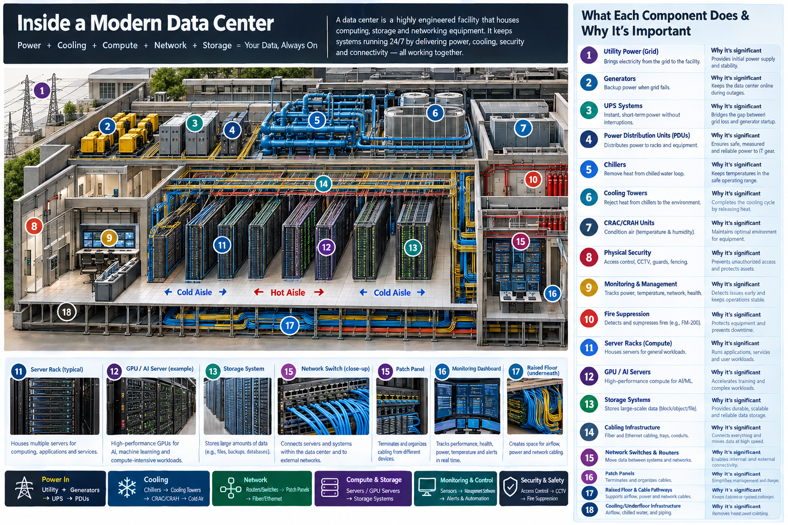

# What You're Actually Paying For When You Use Cloud AI

When you send a query to OpenAI, Azure, or Google, your API price bundles the cost of running **all 18 of these systems** — continuously, at scale, for millions of customers simultaneously.



FleetMind eliminates your dependency on every single one.

---

## The 18 Systems You're Currently Renting

A modern data center is not a server farm. It is an engineered facility requiring six independent disciplines to operate. Every cloud AI provider runs one. You pay for it every month.

### Power (4 systems)

| # | Component | What it does | Why cloud needs it |
|---|---|---|---|
| 1 | **Utility Power (Grid)** | Brings electricity from the grid | Keeps GPUs running 24/7 at megawatt scale |
| 2 | **Generators** | Backup power when grid fails | A power blink drops your query mid-token |
| 3 | **UPS Systems** | Bridges the gap between grid loss and generator startup | Sub-millisecond failover to prevent data corruption |
| 4 | **Power Distribution Units (PDUs)** | Distributes safe, measured power to every rack | A single surge event kills thousands of GPUs |

**FleetMind:** Your phones charge overnight on a USB-C cable. Power infrastructure cost: $0.

---

### Cooling (4 systems)

| # | Component | What it does | Why cloud needs it |
|---|---|---|---|
| 5 | **Chillers** | Remove heat from the chilled water loop | A100 GPUs dissipate 400W each — they melt without active cooling |
| 6 | **Cooling Towers** | Reject heat from chillers to the environment | Transfers heat load out of the building |
| 7 | **CRAC/CRAH Units** | Condition air temperature and humidity at rack level | Humidity kills PCBs; temperature spikes cause thermal throttling |
| 18 | **Cooling/Underfloor Infrastructure** | Airflow, chilled water piping, and underfloor distribution | Delivers cold air precisely where the hottest racks need it |

**FleetMind:** Snapdragon and MediaTek chips dissipate <5W. Passive cooling. No chillers, no cooling towers, no raised floors.

---

### Security & Safety (2 systems)

| # | Component | What it does | Why cloud needs it |
|---|---|---|---|
| 8 | **Physical Security** | Access control, CCTV, guards, fencing | A data center breach = global customer data exposed |
| 10 | **Fire Suppression** | FM-200 or similar agent suppresses electrical fires | One rack fire in an unprotected facility is a total loss |

**FleetMind:** Your building's existing physical security protects the phones. Your IT department already manages it.

---

### Compute & Storage (3 systems)

| # | Component | What it does | Why cloud needs it |
|---|---|---|---|
| 11 | **Server Racks** | Houses servers for general workloads | The physical chassis holding thousands of CPUs and GPUs |
| 12 | **GPU / AI Servers** | High-performance compute for AI/ML workloads | Training and inference at scale requires H100s at $30K each |
| 13 | **Storage Systems** | Large-scale block, object, and file storage | Model weights, logs, embeddings, and customer data at petabyte scale |

**FleetMind:** The phones your IT already issues are the compute. Llama 3.2 1B runs at 15–25 tok/s on any 2022 flagship Android. The "server rack" is a pocket.

---

### Network (3 systems)

| # | Component | What it does | Why cloud needs it |
|---|---|---|---|
| 14 | **Cabling Infrastructure** | Fiber and Ethernet cabling, trays, and conduits | Interconnects every rack at 100 Gbps+ speeds |
| 15 | **Network Switches & Routers** | Move data between systems and external networks | Data center-scale networking requires spine-leaf topology |
| 16 | **Patch Panels** | Terminates and organizes cables from different devices | Thousands of cable runs need structured management |

**FleetMind:** Corporate WiFi. You already pay for it. FleetMind phones discover each other over mDNS in under 10 seconds.

---

### Monitoring & Management (2 systems)

| # | Component | What it does | Why cloud needs it |
|---|---|---|---|
| 9 | **Monitoring & Management** | Tracks power, temperature, network, and health 24/7 | An unmonitored data center fails silently and catastrophically |
| 17 | **Raised Floor & Cable Pathways** | Supports airflow, power routing, and network cabling | Required to physically route the thousands of cables below racks |

**FleetMind:** The FleetMind dashboard shows live fleet status, device health, battery levels, and query throughput. Runs in a browser tab. No NOC required.

---

## The Comparison

| | Traditional Cloud AI | FleetMind |
|---|---|---|
| Power systems | 4 (grid + backup + UPS + PDU) | 0 (phone charger) |
| Cooling systems | 4 (chillers + towers + CRAC + underfloor) | 0 (passive) |
| Security systems | 2 (physical security + fire suppression) | 0 (your building) |
| Compute systems | 3 (racks + GPU servers + storage) | 0 (phones you own) |
| Network systems | 3 (fiber + switches + patch panels) | 0 (corporate WiFi) |
| Monitoring systems | 2 (NOC + raised floor) | 0 (FleetMind dashboard) |
| **Total infrastructure** | **18 engineered systems** | **0 new systems** |
| **Your data leaves the building** | Yes | No |
| **Backend can be subpoenaed** | Yes | No — can't decrypt what we don't have |
| **Cost per query** | $0.002–$0.06 | $0.000 |

---

## What FleetMind Actually Needs

```
1. Corporate WiFi         — you already have it
2. Android phones         — IT already manages them
3. FleetMind software     — one MDM push, 5 minutes
```

That's it. No new hardware. No facility requirements. No ongoing cloud bill.

---

## The Structural Reason Big Tech Can't Do This

Microsoft, Google, and OpenAI are not withholding zero-egress AI because they haven't built it yet. They structurally cannot offer it:

- Their models are proprietary IP — they cannot run on customer hardware without giving the model away
- Their SOC 2 compliance requires audit logs of queries — requiring queries to reach their infrastructure
- Their business model is compute-as-a-service — zero-egress destroys their revenue

They are renting you access to all 18 systems because those 18 systems are what they sell.

FleetMind uses open-weight models (Llama, Gemma, Phi-4) on hardware the customer already owns. There is nothing to rent.

---

## The Security Claim — Precisely Stated

FleetMind's backend routes queries it **mathematically cannot decrypt**.

Each device generates an EC key pair inside ARM TrustZone. The private key is generated inside the hardware security element and never exported — not to our backend, not to RAM. Our server receives an encrypted blob and a device ID. A fully compromised FleetMind backend server sees noise.

This is not a privacy policy. It is `cryptography.exceptions.InvalidTag`.

Run the proof yourself in 30 seconds:

```bash
git clone https://github.com/TanmaySangam18/fleetmind
cd fleetmind/backend && pip install cryptography
python3 demo_blind_routing.py
```

---

*FleetMind — Enterprise AI that runs on hardware you already own, protected by math you can verify.*
